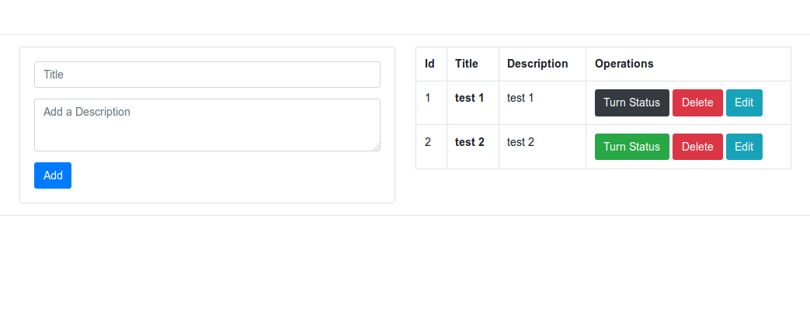

# Example Python Flask Crud

Simple example python flask crud app for sqlite.

## Descripción

Este proyecto es una aplicación web desarrollada en Flask que consiste en un formulario para la recolección de datos, los cuales son almacenados en una base de datos SQL.

### Requisitos
- Python 3.x
- Flask
- SQL Alchemy


## Screenshots


  
 
 
### Installing (for linux)

open the terminal and follow the white rabbit.


```
git clone https://github.com/jelambrar96/flask_app_ig_profile.git
```
```
cd example-flask-crud/
```
```
python3 -m venv venv
```
```
source venv/bin/activate
```
```
pip install --upgrade pip
```
```
pip install -r requirements.txt
```
```
export FLASK_APP=crudapp.py
```
```
flask db init
```
```
flask db migrate -m "entries table"
```
```
flask db upgrade
```
```
flask run
```

## License

This project is licensed under the MIT License - see the [LICENSE](LICENSE) file for details
